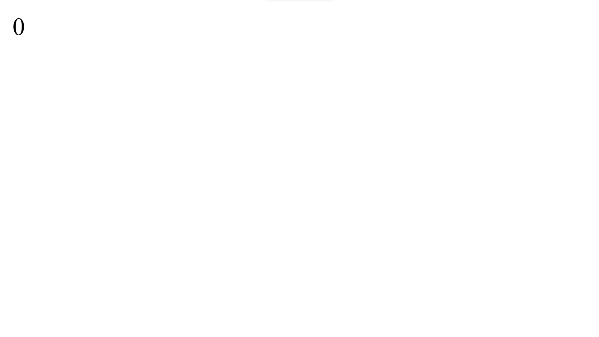
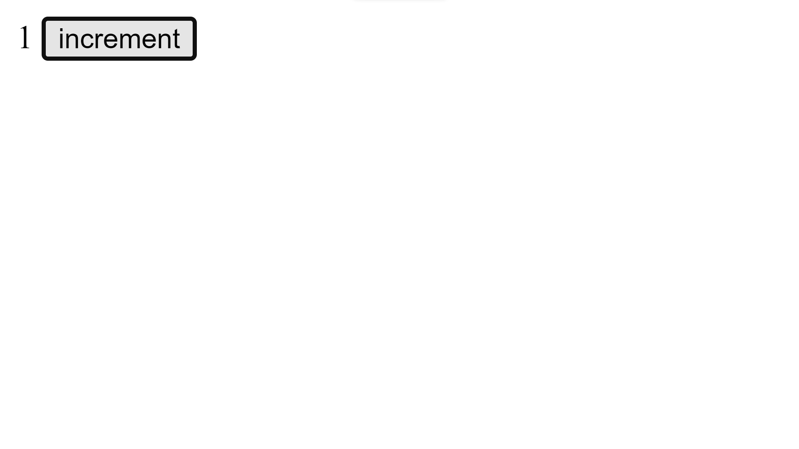
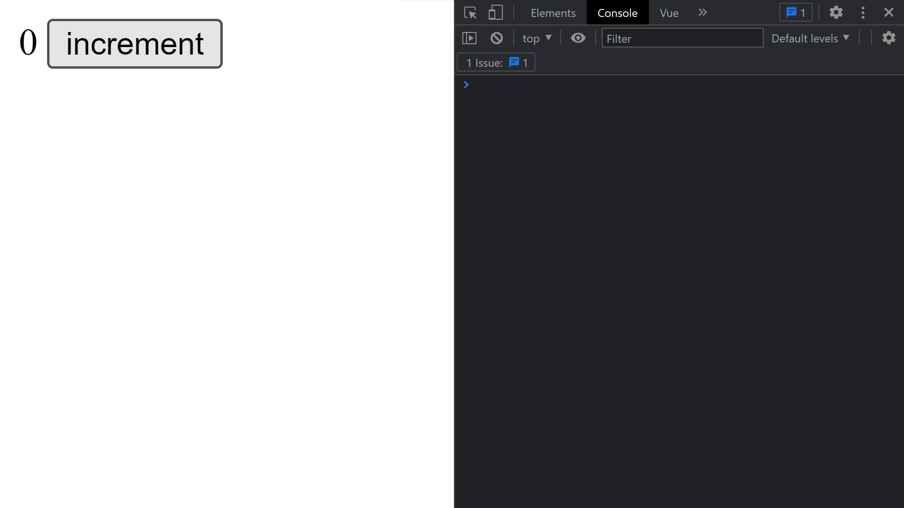
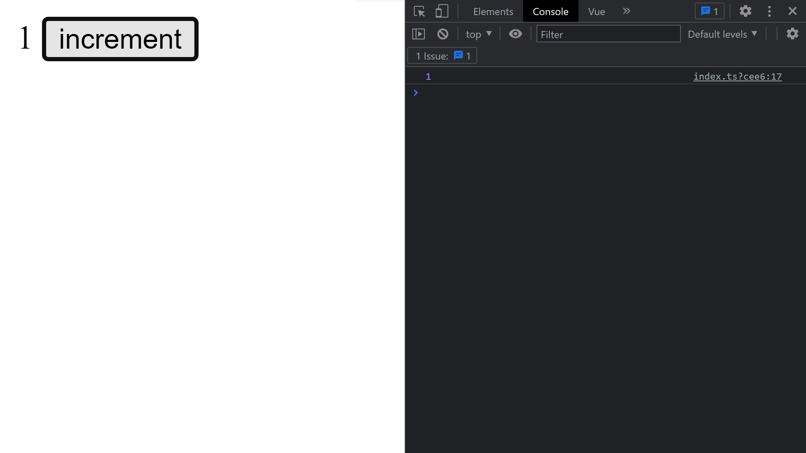

<h1 align="center">stateX-vue</h1>

## Init store
### src/store/index.js
```javascript
import {createStore} from "@/plugins/stateManager";

export default createStore({
    data() {
        return {
            test: 0
        }
    }
});
```
or
```javascript
export default createStore({
    data: {
        test: 0
    }
});
```
### src/main.js
```javascript
import { createApp } from 'vue';
import rootElem from './App.vue';
import store from "@/store";

let app = createApp(rootElem);

app.use(store);

app.mount('#app');
```
### src/App.vue
```vue
<template>
{{store.global.test}}
</template>
```
### result

## Getters
### src/store/index.js
```javascript
export default createStore({
    data: {
        test: 0
    },
    getters: {
        getTest() {
            return this.global.test.value;
        }
    }
});
```
### src/App.vue
```vue
<template>
  {{store.global.test}}
  {{store.global.getTest()}}
</template>
```
### result

## Mutations
### src/store/index.js
```javascript
export default createStore({
    data: {
        test: 0
    },
    mutations: {
        incrementTest() {
            this.global.test.value++;
        }
    },
});
```
### src/App.vue
```vue
<template>
  {{store.global.test}}
  <button @click="store.global.incrementTest()">increment</button>
</template>
```
### result


## Methods
### src/store/index.js
```javascript
export default createStore({
    data: {
        test: 0
    },
    methods: {
        incrementTest() {
            this.global.test.value++;
            console.log(this.global.test.value);
            return this.global.test.value;
        }
    },
});
```
### src/App.vue
```vue
<template>
  {{store.global.test}}
  <button @click="store.global.incrementTest()">increment</button>
</template>
```
### result

