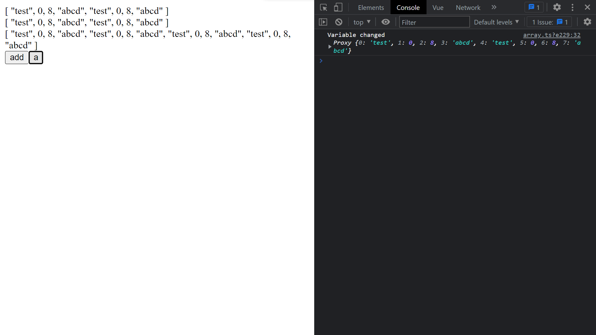

<h1 align="center">stateX-vue</h1>

# Table of Contents
> 1. [Init store](#init-store)
> 2. [Getters](#getters)
> 3. [Mutations](#mutations)
> 4. [Methods](#methods)
> 5. [Computed](#computed)
> 6. [Watch](#watch)
> 7. [Modules](#modules)
> 8. [Config](#config)
# Installation
* Init node project
* Type this in console
```
npm i sbackend
```
## Init store
### src/store/index.js
```javascript
import {createStore} from "@/plugins/stateManager";

export default createStore({
    data() {
        return {
            test: 0
        }
    }
});
```
or
```javascript
export default createStore({
    data: {
        test: 0
    }
});
```
### src/main.js
```javascript
import { createApp } from 'vue';
import rootElem from './App.vue';
import store from "@/store";

let app = createApp(rootElem);

app.use(store);

app.mount('#app');
```
### src/App.vue
```vue
<template>
{{store.global.test}}
</template>
```
### result

## Getters
### src/store/index.js
```javascript
export default createStore({
    data: {
        test: 0
    },
    getters: {
        getTest() {
            return this.global.test.value;
        }
    }
});
```
### src/App.vue
```vue
<template>
  {{store.global.test}}
  {{store.global.getTest()}}
</template>
```
### result

## Mutations
### src/store/index.js
```javascript
export default createStore({
    data: {
        test: 0
    },
    mutations: {
        incrementTest() {
            this.global.test.value++;
        }
    }
});
```
### src/App.vue
```vue
<template>
  {{store.global.test}}
  <button @click="store.global.incrementTest()">increment</button>
</template>
```
### result

after click

## Methods
### src/store/index.js
```javascript
export default createStore({
    data: {
        test: 0
    },
    methods: {
        incrementTest() {
            this.global.test.value++;
            console.log(this.global.test.value);
            return this.global.test.value;
        }
    }
});
```
### src/App.vue
```vue
<template>
  {{store.global.test}}
  <button @click="store.global.incrementTest()">increment</button>
</template>
```
### result

after click

## Computed
### src/store/index.js
```javascript
export default createStore({
    data: {
        test: 8
    },
    computed: {
        test0() {
            return this.global.test.value * this.global.test.value;
        }
    }
});
```
### src/App.vue
```vue
<template>
  {{store.global.test}}
  {{store.global.test0}}
</template>
```
### result

## Watch
### src/store/index.js
```javascript
export default createStore({
    data: {
        test: 0
    },
    watch: {
        test(newValue) {
            console.log("Variable changed", newValue);
        }
    }
});
```
### src/App.vue
```vue
<template>
  {{store.global.test}}
  <button @click="store.global.test++">Change</button>
</template>
```
### result

after 8 clicks

## Modules
### src/store/index.js
```javascript
import array from "@/store/array";

export default createStore({
    modules: {
        array
    }
});
```
### src/store/array.js
```javascript
import { createStoreModule } from "@/plugins/stateManager";

export default createStoreModule({
    data: {
        array: ["test", 0, 8, "abcd"]
    },
    getters: {
        getArray() {
            return this.array.array.value;
        }
    },
    mutations: {
        addElem(elem: any) {
            this.array.array.value.push(elem);
        }
    },
    computed: {
        double() {
            return [...this.array.array.value, ...this.array.array.value];
        }
    },
    methods: {
        a() {
            this.array.array.value = this.array.double.value;
            return this.array.array.value;
        }
    },
    watch: {
        array: {
            handler(newValue) {
                console.log("Variable changed", newValue);
            },
            deep: true
        }
    }
});
```
### src/App.vue
```vue
<template>
  {{store.array.array}}
  <br>
  {{store.array.getArray()}}
  <br>
  {{store.array.double}}
  <br>
  <button @click="store.array.addElem(Math.random())">add</button>
  <button @click="store.array.a()">a</button>
</template>
```
### result



## Config
### Name
#### src/store/index.js
```javascript
export default createStore({
    data: {
        test: 0
    }
}, {
    name: "store0"
});
```
#### src/App.vue
```vue
<template>
{{store0.global.test}}
</template>
```
### DefaultModuleName
#### src/store/index.js
```javascript
export default createStore({
    data: {
        test: 0
    }
}, {
    defaultModuleName: "default"
});
```
#### src/App.vue
```vue
<template>
{{store.default.test}}
</template>
```
### DefaultModuleName = ""
#### src/store/index.js
```javascript
export default createStore({
    data: {
        test: 0
    }
}, {
    defaultModuleName: ""
});
```
#### src/App.vue
```vue
<template>
{{store.test}}
</template>
```